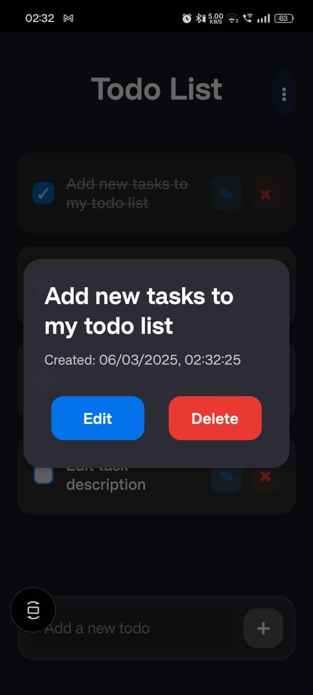

# TodoList App

A feature-rich task management application built with React Native, designed to help you stay organized and productive.

  

## Features

- ✨ Intuitive task management interface
- 📝 Create, edit, and delete tasks
- ✅ Mark tasks as complete
- 🗂️ Organize tasks by categories
- 🔍 Search and filter tasks
- 📱 Cross-platform support (iOS & Android)
- 🌙 Dark mode support
- 🔄 Real-time updates

## Technologies Used

- [**React Native**](https://reactnative.dev) - Core framework for building the mobile application
- **Redux** - State management
- **AsyncStorage** - Local data persistence
- **React Navigation** - Navigation management
- **React Native Paper** - UI components
- **TypeScript** - Type-safe development

## Download

You can download the latest version of the TodoList app for Android:

[📱 Download TodoList APK](./assets/todolist.apk)

## Getting Started

### Prerequisites

> **Note**: Make sure you have completed the [React Native Environment Setup](https://reactnative.dev/docs/environment-setup) before proceeding.

### Installation

1. Clone the repository
2. Install dependencies:

```sh
npm install
# OR
yarn install
```

### Running the App

#### Start Metro Server

```sh
# Using npm
npm start

# OR using Yarn
yarn start
```

#### Run on Android

```sh
# Using npm
npm run android

# OR using Yarn
yarn android
```

#### Run on iOS

First, install CocoaPods dependencies:

```sh
bundle install
bundle exec pod install
```

Then run the app:

```sh
# Using npm
npm run ios

# OR using Yarn
yarn ios
```

## Development

### Making Changes

Open `App.tsx` or any other source files in your preferred editor and make changes. The app will automatically reload with your changes thanks to Fast Refresh.

To force reload:

- **Android**: Press <kbd>R</kbd> twice or select "Reload" from the Dev Menu (<kbd>Ctrl</kbd> + <kbd>M</kbd> on Windows/Linux, <kbd>Cmd ⌘</kbd> + <kbd>M</kbd> on macOS)
- **iOS**: Press <kbd>R</kbd> in iOS Simulator

## Troubleshooting

If you encounter any issues, please check the [React Native Troubleshooting Guide](https://reactnative.dev/docs/troubleshooting).

## Learn More

- [React Native Documentation](https://reactnative.dev/docs/getting-started)
- [React Navigation Documentation](https://reactnavigation.org/)
- [Redux Documentation](https://redux.js.org/)
- [TypeScript Documentation](https://www.typescriptlang.org/docs/)

## License

This project is licensed under the MIT License.
